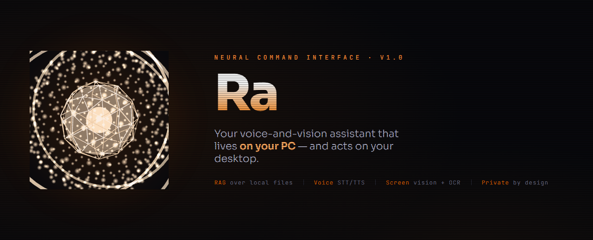
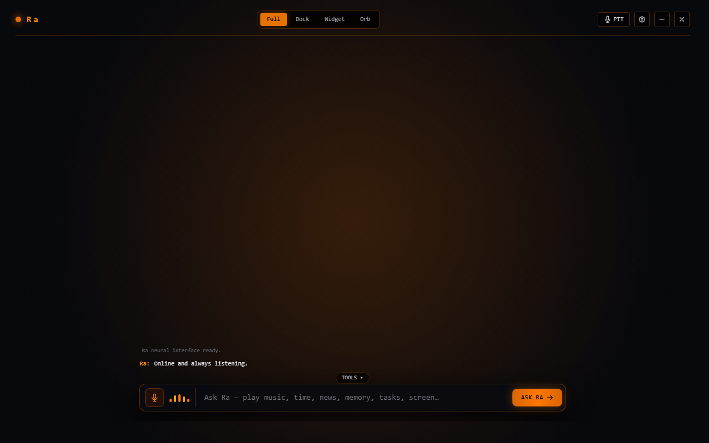

<div align="center">



<br/>

**Ra** is a personal, **Retrieval-Augmented** virtual assistant that lives on *your* PC.

An LLM brain (Gemini / Groq, via your own API key) answers from a local RAG index over **your files** — then takes *real action* on your desktop: opening apps, controlling media, understanding the screen, and running system tasks.

<br/>


*Built for ISRO's Smart India Hackathon 2025 — Problem SIH26171 · On-device Visual Perception for Lightweight Browser Agents.*

</div>

---

## ✦ What Ra does

| | |
|---|---|
| 🎙️ **Voice-first** | Hands-free conversations with an always-on wake word — streaming STT (Vosk), Whisper finalize, and instant neural TTS (Edge / local fallbacks). |
| 🧠 **RAG over your files** | Index local folders (md, pdf, code, csv, logs…) into a pure-stdlib SQLite semantic store. Ask in natural language; answers are grounded in **your** data. |
| 👁️ **Sees your screen** | OCRs the visible desktop for context, and — with consent — *drives* the UI visually: screenshot → model decides the click → post-click verification. |
| ⚡ **Takes real actions** | 85+ skills across 15 categories: launch apps, media control, system telemetry, battery, weather, web lookups, and more. |
| 🔒 **Private by design** | Retrieval-only from **granted** sources (`files` / `devices` / `screen`). Optional PII redaction. Your key never leaves the app. |

---

## ✦ Preview

<div align="center">

| HUD window · full/dock/widget/orb modes | Floating orb · wake-word assistant |
|---|---|
|  |  |

</div>

The shell is a `FastAPI` bridge + `pywebview` window. Four shapes — **full**, lateral **dock**, **widget**, and the draggable **orb** that listens for the wake word and expands on click.

---

## ✦ Quickstart — Windows

**Easiest:** double-click **`run.bat`** → choose from the menu:

```
[1] Start Ra        (voice + HUD window)
[2] Ask a question  (text)
[3] Quick demo      (index docs, then ask)
[4] Run all tests
[5] Install / repair dependencies
[6] Build the .exe
```

**Or from a terminal:**

```powershell
# 1. your LLM key (one provider — provider auto-detected, or set RA_LLM_PROVIDER)
copy .env.example .env        # -> RA_GEMINI_API_KEY or RA_GROQ_API_KEY

# 2. runtime deps
pip install -r requirements.txt

# 3. run
python run_app.py                       # voice + text HUD
python ra_cli.py rag index              # index your default docs
python ra_cli.py rag search "what did we decide about the API key"
python ra_cli.py ask "what's my budget note about?"
```

Add the folder to `PATH` and use `ra` anywhere:

```powershell
ra ask "beat sheet by 'gem'"
ra rag index --dir "C:\Docs"
ra rag search "screen redaction"
```

> The RAG core (embedding, indexing, store, retrieval, CLI, tests) is **pure Python standard lib + SQLite** — it runs fully offline with zero heavy dependencies.

---

## ✦ Build a standalone .exe

Double-click **`run.bat` → option 6** (or `build_exe.bat`). PyInstaller bundles the app and copies your API key to `~\.ra\.env` (read at runtime — **never embedded in the exe**):

```
hud\dist\Ra.exe    double-click to launch the HUD
~\.ra\ra.log       debug output when running console-less
```

Rotate the key anytime: just edit `~\.ra\.env` and restart — no rebuild needed.

---

## ✦ Data sources & consent

Ra only touches what you **grant** — adjustable in-session via the `set_access` skill or `ra_cli.py rag grant|revoke files|devices|screen`:

- **files** — `ra_cli.py rag index --dir <path>` · txt/md/pdf/code/csv/logs…
- **devices** — system + audio snapshot (`refresh_device_snapshot` / `rag ingest-devices`)
- **screen** — visible desktop; OCR'd to text only (`capture_screen` / `rag ingest-screen`), or with computer access granted, controlled visually via `gui_do` (screenshot → model decides → verified click) and named-control clicks via `ui_find` / `ui_click`.

## ✦ Privacy & secrets

- Your LLM key (Gemini / Groq) is read from the environment / `.env` (gitignored) — never hardcoded, never committed.
- Screen pixels are passed to the vision model **only** for the action in flight, and never stored.
- All retrieval, indexing, and retrieval runs on-device in a local SQLite index.

---

## ✦ Verified

- ✅ Full pytest suite passes offline — embedding determinism, chunking, SQLite store + persistence, retrieval filtering, RAG-context injection with an injected fake LLM, provider routing (gemini/groq), 429 retry/backoff, consent gating, CLI, secret hygiene, screen-vision action parsing.
- ✅ HUD shell — FastAPI bridge + pywebview (full/dock/widget/orb) built as `Ra.exe`.

---

## ✦ Architecture

`src/ra/` is the brain — LLM routing (`brain.py`), RAG core (`rag/`), voice STT/TTS (`audio_io.py`, `transcribe.py`), screen vision (`vision.py`, `computer.py`, `uia.py`), skills (`skills.py`), plus `monitor.py`, `scheduler.py`, `memory.py`, and `fastlane.py`.

```
Ra/
  src/ra/        the brain: LLM routing, RAG core, voice, tools + screen vision
  hud/           the HUD shell: FastAPI bridge + pywebview window, orb, ra.spec
  tests/         unit tests (pytest, offline)
  ra_cli.py      retrieval CLI — rag index/search/stats · ask
  run_app.py     desktop assistant entry
  docs/          design & SIH26171 documentation
```

## ✦ Documentation

Four deep-dive docs built for the Smart India Hackathon judging criteria:

- [**Project Overview & Architecture**](docs/SIH26171-OVERVIEW.md) — system design, SIH26171 alignment, criteria mapping
- [**Feature & Skills Catalog**](docs/SIH26171-FEATURES.md) — 85+ tools across 15 categories
- [**Privacy & Security Architecture**](docs/SIH26171-PRIVACY.md) — consent gating, PII redaction, local-only processing
- [**Technical Deep Dive**](docs/SIH26171-TECHNICAL.md) — brain routing, vision pipeline, DPI, hybrid STT, WebGPU roadmap

## ✦ License

MIT — see [`LICENSE`](LICENSE).